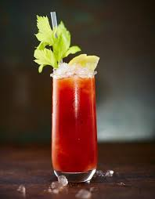

# Bloody Mary




Materials for this recipe include a mixing spoon, measuring spoons, and alcohol jigger. The ingredients are as follows: 

##Ingredients

* 2 parts Absolut Vodka

* 3 parts tomato juice

* 1/4 part worcestershire Sauce

* 1/4 part lemon juice

* 2 dashes hot sauce

* 1 teaspoon horseradish

* 1 stick Celery


##Steps


###How to mix
1. 
1. Stir all ingredients in a mixing glass.
1. 
Pour into a chilled highball glass.

1. Add ice cubes.
1. Garnish with celery, and enjoy!