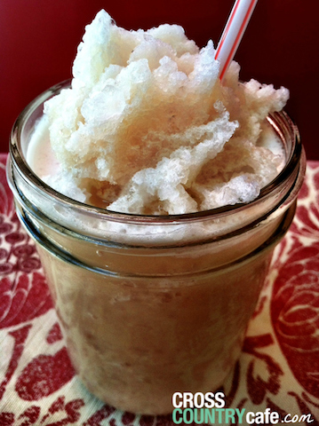

# Vanilla Frappuccino



Materials for this recipe include a keurig, and blender. The ingredients are as follows: 

##Ingredients

* 1 Cafe Escapes Cafe Vanilla Keurig K-cup coffee
* ice


##Directions
1. Start by brewing you Cafe Escapes Cafe Vanilla Keurig K-cup on the lowest water setting of your Keurig brewer.  
1. Place the brewed coffee in the fridge to chill for one hour.
1. Combine the now chilled Cafe Vanilla coffee and 2 cups of ice in a blender. 
1. Blend until the ice reached your desired consistency.